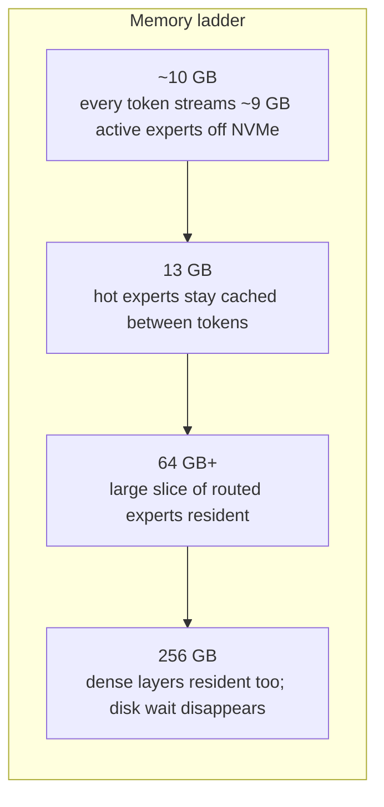
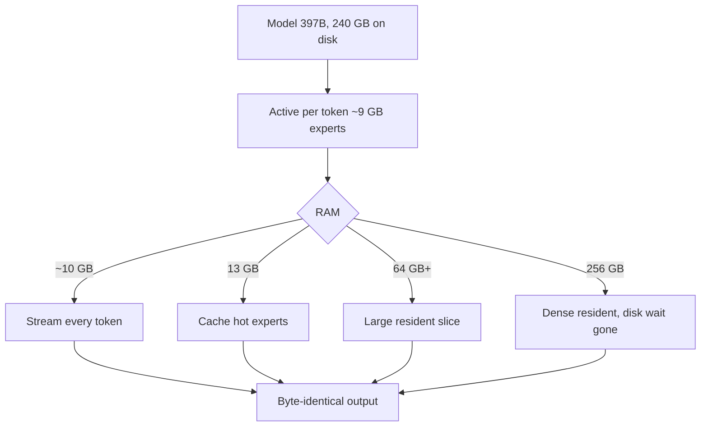
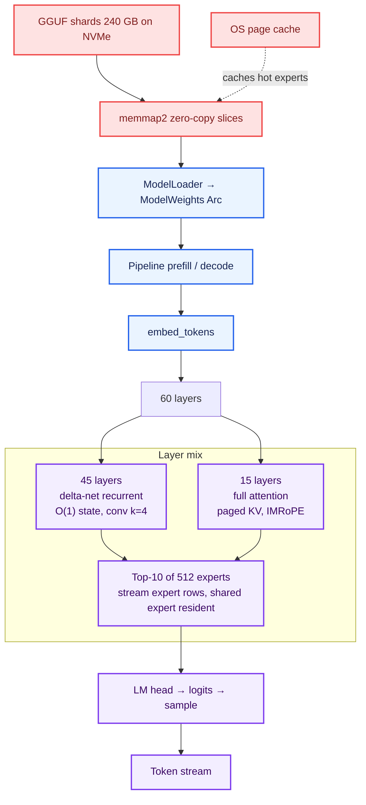
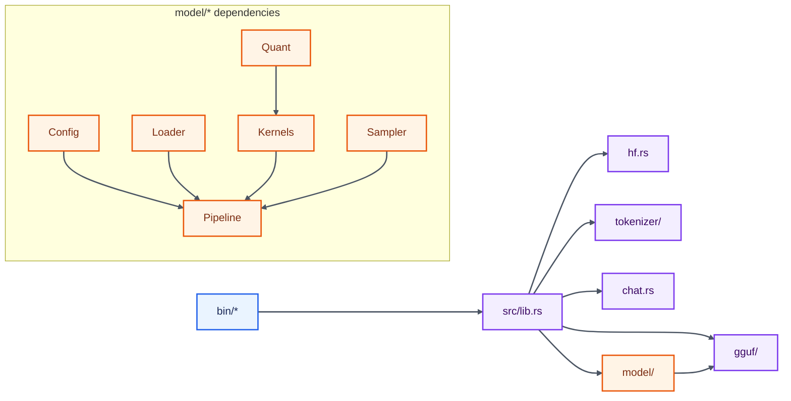
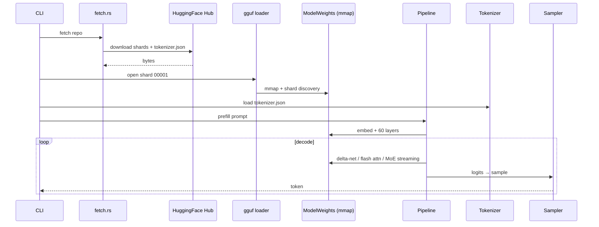
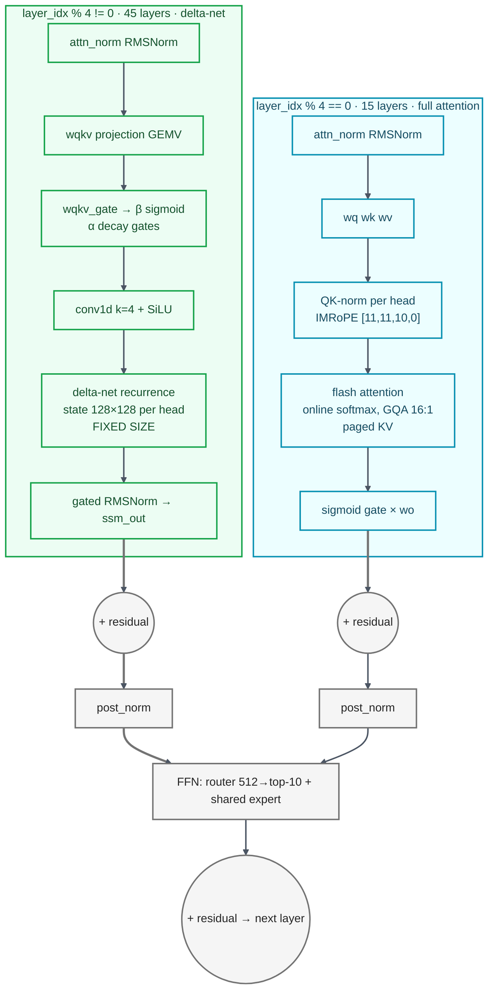
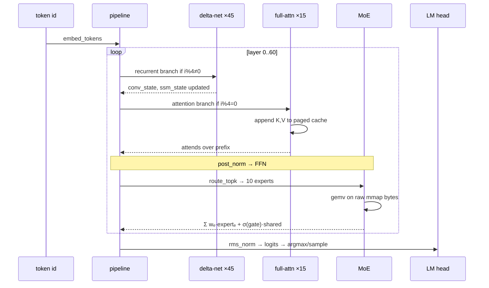
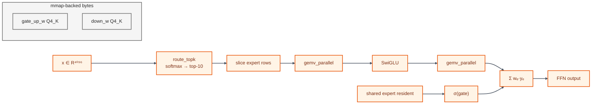
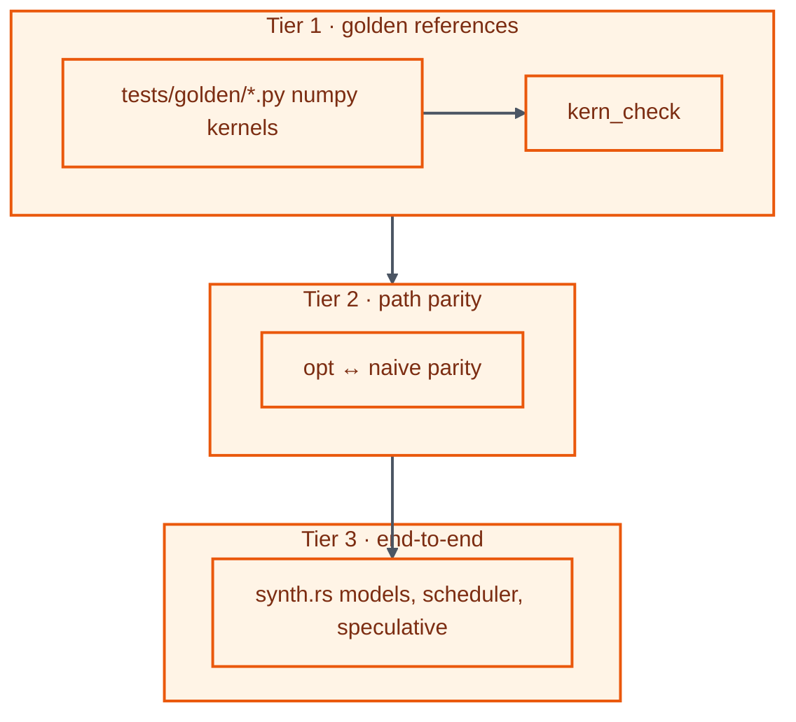

# Qwen3.5-397B-A17B — CPU-only inference in safe Rust

<div align="center">

<h3>A 397-billion-parameter model. One CPU. 10–14 GB RSS.</h3>

<p>Qwen3.5-397B-A17B inference in safe Rust. No CUDA. No BLAS. No framework.</p>

<p>
<a href="https://github.com/shinde/qwen3-5-397b-in-rust/actions"></a>


<a href="#requirements"></a>
</p>

<table>
<tr>
<td align="center"><b>397 B</b><br><sub>parameters</sub></td>
<td align="center"><b>240 GB</b><br><sub>checkpoint on disk</sub></td>
<td align="center"><b>~10–14 GB</b><br><sub>RSS ceiling, mmap-streamed</sub></td>
<td align="center"><b>13 888</b><br><sub>lines of Rust</sub></td>
<td align="center"><b>0</b><br><sub>GPUs</sub></td>
</tr>
</table>

<p><b>The same model runs in 12 GB and would run in 224 GB — identical tokens, different clocks.</b><br>
More memory only buys speed, because the OS page cache is the expert cache:</p>

<table>
<tr><th align="left">machine</th><th align="right">free RAM</th><th align="left">what is going on</th></tr>
<tr><td align="left">small laptop</td><td align="right">~10 GB</td><td>every token streams ~9 GB of active experts off NVMe</td></tr>
<tr><td align="left">this laptop</td><td align="right">13 GB</td><td>hot experts stay cached between tokens; cold ones stream</td></tr>
<tr><td align="left">workstation</td><td align="right">64 GB+</td><td>a large slice of routed experts becomes resident</td></tr>
<tr><td align="left">server</td><td align="right">256 GB</td><td>dense layers resident too; disk wait disappears</td></tr>
</table>
</div>

> **Open to Opportunities:** ==I am open to AI research / AI/ML related roles and PhD positions==


> 


> **Status (2026-09-01):** the engine compiles clean, all 106 lib tests + 5
> crossval tests pass, and each layer can be streamed from the real 7-shard
> checkpoint — but **end-to-end generation on the real checkpoint is still
> under verification** (logits are peaked but the argmax is not yet coherent).
> The flat-logits bug is fixed; the remaining content-loss hunt is tracked in
> **[`docs/PROGRESS.md`](docs/PROGRESS.md)**. Rows below that say "byte-identical
> output" are about the memory ladder (RAM changes speed only), not correctness
> of the checkpoint run.

---

## Contents

**Part I: Getting started**
- [Requirements](#requirements)
- [Quick start](#quick-start)
- [Full setup](#full-setup)
- [Usage](#usage)
- [Choosing a memory preset](#choosing-a-memory-preset)
- [Reading the run report](#reading-the-run-report)
- [Common questions](#common-questions)

**Part II: How it works**
- [System Architecture](#system-architecture)
- [Component / Service Relationships](#component--service-relationships)
- [Data Flow](#data-flow)
- [Detailed Workflows — Model Architecture](#detailed-workflows---model-architecture)

**Part III: Validation**
- [Validation pyramid](#validation-pyramid)

**Part IV: Measurements**
- [Memory ladder](#memory-ladder)

**Part V: Reference**
- [Project Overview](#project-overview)
- [Project Structure](#project-structure)
- [Configuration & Invariants](#configuration--invariants)
- [Local Development / Setup](#local-development--setup)
- [Running the System](#running-the-system)
- [Testing](#testing)
- [Deployment](#deployment)
- [Troubleshooting](#troubleshooting)
- [Future Improvements](#future-improvements)
- [License](#license)

---

## Requirements

The gate is storage: the checkpoint is **~240 GB** as 7-shard Q4_K_M GGUF. Everything else is ordinary.

| | | |
|---|---|---|
| **OS** | Linux x86-64 / aarch64 | `memmap2`, `mmap`, `getrusage` |
| **CPU** | AVX2 + FMA or NEON | SIMD dispatch, safe Rust SIMD |
| **RAM** | 10 GB and up | 10 GB floor; more memory is faster, never different |
| **Storage** | ~250 GB free | 240 GB checkpoint + tokenizer, ideally NVMe |
| **Toolchain** | Rust ≥1.80 | Cargo, clippy, no C dependencies |

The tokenizer and config reader are pure Rust and build anywhere. Without a checkpoint you can still do everything in [Quick start](#quick-start).

## Quick start

Clone, build and run the entire test suite. **No checkpoint, no network, no Python**. The whole thing takes about a minute.

```bash
git clone https://github.com/shinde/qwen3-5-397b-in-rust.git
cd qwen3-5-397b-in-rust
cargo build --release
cargo test
```

It ends like this, or it fails:

```
test result: ok. 106 passed; 0 failed
clippy: 0 warnings
```

That is the whole engine: every kernel, the streaming MoE, GGUF reader, config validation, tokenizer, and end-to-end oracles over synthetic models checked against NumPy references.

## Full setup

Five steps from an empty directory to generated text. Only step 4 is slow.

### Step 0. clone

```bash
git clone https://github.com/shinde/qwen3-5-397b-in-rust.git
cd qwen3-5-397b-in-rust
```

### Step 1. build

```bash
cargo build --release
```

Seconds. Only Rust toolchain required.

### Step 2. verify before downloading anything

```bash
cargo test
```

Proves the engine matches its references on synthetic models with the same tensor graph, and needs nothing but the repository.

### Step 3. fetch the checkpoint

**~240 GB, so hours rather than minutes.** Use the provided fetch binary:

```bash
cargo run --bin fetch -- lmstudio-community/Qwen3.5-397B-A17B-GGUF \
  --file Qwen3.5-397B-A17B-Q4_K_M-00001-of-00007.gguf \
  --out ~/models/qwen35-397b
curl -L -o ~/models/qwen35-397b/tokenizer.json \
  https://huggingface.co/Qwen/Qwen3.5-397B-A17B/resolve/main/tokenizer.json
```

The script verifies SHA-256 and shard completeness. A partial download produces wrong tokens.

### Step 4. run

```bash
./target/release/run ~/models/qwen35-397b/Qwen3.5-397B-A17B-Q4_K_M-00001-of-00007.gguf \
  ~/models/qwen35-397b/tokenizer.json "The capital of France is" --n-predict 128 --kv-q8
```

The first token loads the cold page cache, so it is slower than steady state. That cost is paid once per run.

## Usage

### Synopsis

```
run <model_shard> <tokenizer.json> [prompt] [options]
```

### Prompt options

- Text on CLI: `--prompt "text"`
- Text from file: `--prompt-file PATH`
- Token ids: `--ids 1,2,3`

### Memory options

The engine uses OS page cache as the expert cache. No explicit `--preset` flag; memory is controlled by system RAM and `--kv-q8` for KV compression.

| flag | effect |
|---|---|
| `--kv-q8` | quantise KV cache to Q8_0, halves KV memory |
| `--n-predict` | tokens to generate |

### Worked examples

```bash
# Smallest possible run, the 10 GB floor
./target/release/run <model> <tokenizer> --prompt "Hello! My name is" --n-predict 16

# KV compression for longer contexts
./target/release/run <model> <tokenizer> --prompt-file prompt.txt --n-predict 256 --kv-q8

# Chat mode
./target/release/run <model> <tokenizer> --chat --kv-q8
```

## Choosing a memory preset

More RAM only buys speed, because the OS page cache is the expert cache:



- **10 GB**: floor, runs slowly, byte-identical output.
- **13 GB**: typical laptop, hot experts cached.
- **64 GB+**: workstation, substantial resident set.
- **256 GB**: server, dense layers resident.

Output is identical at every budget; only the clock changes.

## Reading the run report

The engine prints a memory plan, timings per token, and peak RSS.

Key numbers:
- **PEAK RSS**: from `getrusage`, quote this, not the plan.
- **I/O share**: disk time vs wall clock, dominated by cold cache.
- **Tokens/s**: steady state after the first token.

## Common questions

**First token slow** – cold page cache; subsequent tokens warm.

**Output changes with RAM?** – No. Greedy decoding is byte-identical; RAM changes speed only.

**Missing tensors** – Loader validates and warns on shard boundaries.

**Non-ASCII prompt tokenizes oddly** – Use `--prompt-file`, so the shell does not re-encode argv.

## Memory ladder



## Core Memory & Model Operation

The engine keeps the 240 GB checkpoint on disk and streams only what is needed per token. Memory residency is controlled by the OS page cache, not by explicit buffers.



**What happens per token**
- The model stays mmapped; only the 10 experts per MoE layer and the current layer weights touch disk.
- Delta-net layers keep a fixed 128×128 state per head, so sequence memory is O(1) for 45/60 layers.
- Full-attention layers grow paged KV, but only 15 of 60 layers do so.
- The OS page cache acts as the expert cache: hot experts stay resident, cold ones stream. More RAM → more hits → faster, never different output.

---

## Project Overview

This repository implements a CPU-only inference engine for **Qwen3.5-397B-A17B** in safe Rust. The model is shipped as 7-shard Q4_K_M GGUF (~240 GB). Rather than requiring the full checkpoint in RAM, the engine mmmaps the shards, streams only the experts that fire per token, and uses delta-net recurrence for 45 of 60 layers to keep sequence memory O(1).

The implementation is verified against the production checkpoint header and validated with a three-tier golden reference, path parity, and end-to-end synthetic tests.

### Key Features

| Feature | Detail |
|---|---|
| **Memory streaming** | `memmap2` zero-copy access; OS page cache as expert cache |
| **Streaming MoE** | Top-10 of 512 experts per layer; only touched rows are read |
| **Hybrid attention** | 45 delta-net recurrent layers + 15 full-attention layers (`full_attention_interval=4`) |
| **Quantized kernels** | Q8_0 / Q4_K / Q5_K / Q6_K / F32 with AVX2+FMA / NEON dispatch |
| **Paged KV + optional Q8** | Geometric growth cache, absolute-position indexed |
| **Speculative verification** | Greedy draft accept/reject with state snapshotting |
| **Chat & batching** | Qwen3.5 ChatML template, continuous batching, chunked prefill |
| **Test pyramid** | 106 tests, numpy golden references, scalar/SIMD parity |

## System Architecture

```mermaid
flowchart TB
    subgraph User["User / CLI"]
        Run["bin/run.rs<br/>completion / chat / batch"]
        Bench["bin/bench.rs<br/>micro & e2e timings"]
        Fetch["bin/fetch.rs<br/>HF download + SHA-256"]
        KernCheck["bin/kern_check.rs<br/>numpy ↔ Rust parity"]
    end

    subgraph Lib["qwen3-5-397b-in-rust"]
        Tokenizer["tokenizer/<br/>tokenizers crate"]
        GGUF["gguf/*<br/>v3 parser, metadata, multi-shard"]
        HF["hf.rs<br/>HF Hub helpers"]
        Chat["chat.rs<br/>Qwen3.5 ChatML template"]
        Model["model/*"]
    end

    subgraph Model["model"]
        Config["config.rs<br/>Qwen3_5Config + validation"]
        Quant["quant.rs<br/>Q8/Q4K/Q5K/Q6K codecs"]
        SIMD["simd.rs<br/>AVX2/NEON dispatch"]
        Kernels["kernels.rs<br/>norms, GEMV/GEMM, IMRoPE, flash attn, delta-net, MoE"]
        Loader["loader.rs<br/>shard assembly → ModelWeights"]
        Pipeline["pipeline.rs<br/>prefill, decode, scheduler, verify_draft, timing"]
        Sampler["sampler.rs<br/>temp/top-k/top-p/repeat"]
        Synth["synth.rs<br/>synthetic GGUF factory"]
    end

    Run --> Tokenizer
    Run --> GGUF
    Run --> Chat
    Run --> Model
    Bench --> Model
    Fetch --> HF
    Fetch --> GGUF
    KernCheck --> Kernels

    classDef cli fill:#EAF4FF,stroke:#2563EB,stroke-width:2px,color:#172554;
    classDef lib fill:#F3EEFF,stroke:#7C3AED,stroke-width:2px,color:#3B0764;
    classDef model fill:#FFF4E6,stroke:#EA580C,stroke-width:2px,color:#7C2D12;
    class User,Run,Bench,Fetch,KernCheck cli;
    class Tokenizer,GGUF,HF,Chat,Lib lib;
    class Config,Quant,SIMD,Kernels,Loader,Pipeline,Sampler,Synth,Model model;
    linkStyle default stroke:#4b5563,stroke-width:2px;
```



**How it fits together**

* **Fetch** resolves a HuggingFace repo, lists GGUF files, downloads with resume and SHA-256 verification, and optionally pulls `tokenizer.json`.
* **GGUF** parses v3 headers, metadata, tensor descriptors, and discovers split shards. `memmap2` provides zero-copy `&[u8]` slices.
* **Loader** assembles the shards into `ModelWeights` with `Arc<Mmap>`-backed raw tensors.
* **Config** builds a typed `Qwen3_5Config` from metadata and validates invariants (arch name, rope sections `[11,11,10,0]`, derived dims).
* **Pipeline** drives token-by-token forward passes: embed → 60 layers → LM head → sample. GenerationState holds paged KV, conv/SSM buffers, and timing.
* **Kernels** implement numeric primitives with scalar reference paths and SIMD-optimized dispatches. Quantized GEMV runs block-wise against packed weights without full dequantization.
* **Streaming MoE** routes top-10 experts, slices only those expert rows from mmap, and accumulates weighted outputs with a resident shared expert.

## Component / Service Relationships



## Data Flow



## Major Pipelines

### 1. Fetch & Verify Pipeline

Inputs: repo_id, optional file, output directory  
Processing: list GGUF files, resolve URL, streaming download with `.part` resume, SHA-256 check, tokenizer fetch  
Outputs: GGUF shards on disk, `tokenizer.json`  
Dependencies: `hf.rs`, `ureq`, `memmap2`

### 2. Load & Validate Pipeline

Inputs: first shard path  
Processing: GGUF header parse → metadata → `Qwen3_5Config::from_metadata` → invariant validation → shard discovery → `ModelLoader` → `ModelWeights`  
Outputs: validated config + mmap-backed tensors  
Key files: `src/gguf/*`, `src/model/config.rs`, `src/model/loader.rs`

### 3. Prefill → Decode Pipeline

Inputs: token ids  
Processing:
* `embed_tokens` f32 gather
* For each of 60 layers:
  * Delta-net branch if `layer % 4 != 0` else flash attention
  * RMSNorm → projection → gating → recurrence / attention
  * Post-norm → MoE / SwiGLU with top-10 routing, streaming GEMV
* LM head RMSNorm → logits → sample

Outputs: generated token stream, `GenerationState` with timings  
See `src/model/pipeline.rs` and the anatomy diagram below.

### 4. Chat Pipeline

`chat.rs` implements the text-only Qwen3.5 ChatML template: `<|im_start|>{role}\n{content}<|im_end|>\n`, thinking-mode toggle, system prompt, truncation.

### 5. Batch & Speculative Pipelines

* Batch: lockstep parallel decode via scheduler
* Speculative: `verify_draft` snapshots conv/SSM/KV buffers, verifies `[ctx]+draft` in one batched pass, rolls back and re-drives accepted tokens.

## Detailed Workflows — Model Architecture

### Two kinds of attention



**Legend**
* <span style="background:#ECFDF3; border:2px solid #16A34A; padding:2px 6px;">Green</span> DeltaNet / Linear Attention · 45 layers
* <span style="background:#ECFEFF; border:2px solid #0891B2; padding:2px 6px;">Teal</span> Full Attention · 15 layers
* <span style="background:#F5F5F5; border:2px solid #737373; padding:2px 6px;">Gray</span> Shared Computation

### Decode step anatomy



### Streaming MoE



### Validation pyramid



## Project Structure

```
src/
├── gguf/            GGUF v3 reader/writer, metadata, tensor, header
├── hf.rs            HF Hub helpers, resumable download, SHA-256
├── tokenizer/       tokenizer.json loader
├── chat.rs          Qwen3.5 ChatML template
├── model/
│   ├── config.rs    metadata → typed config + validator
│   ├── quant.rs     Q8_0/Q4_K/Q5_K/Q6_K/F32 codecs
│   ├── simd.rs      AVX2+FMA / NEON dispatch
│   ├── kernels.rs   norms, GEMV/GEMM, IMRoPE, flash attn, delta-net, MoE
│   ├── loader.rs    shard assembly → ModelWeights
│   ├── pipeline.rs  prefill/decode, paged KV, scheduler, verify_draft, timing
│   ├── sampler.rs   temperature/top-k/top-p/repeat-penalty
│   └── synth.rs     synthetic GGUF factory
└── bin/
    ├── run.rs       completion / chat / batch CLI
    ├── bench.rs     micro & e2e benchmarks
    ├── kern_check.rs numpy harness
    └── fetch.rs     downloader
tests/
├── e2e.rs
└── golden/          python generators + checkers
ref/                 llama.cpp / ggml reference sources
```

## Configuration & Invariants

`Qwen3_5Config` is built from GGUF metadata and validates:

* `general.architecture` = `qwen35moe` or `qwen3_5moe`
* `full_attention_interval = 4`, `block_count = 60`
* `expert_count = 512`, `expert_used_count = 10`
* `rope_sections = [11,11,10,0]`
* Derived dims: `conv_dim = 2*key_dim + value_dim`, `ba_dim = 2*ssm_time_step_rank`

Production metadata is pinned in `validate_accepts_real_397b_metadata`.

## Local Development / Setup

```bash
git clone https://github.com/shinde/qwen3-5-397b-in-rust.git
cd qwen3-5-397b-in-rust
cargo build --release
cargo test   # 106 tests, no checkpoint required
```

Requirements: Linux x86-64/aarch64, Rust ≥1.80, 8 GB RAM for tests, 240 GB storage for model.

## Running the System

Fetch checkpoint:
```bash
cargo run --bin fetch -- lmstudio-community/Qwen3.5-397B-A17B-GGUF \
  --file Qwen3.5-397B-A17B-Q4_K_M-00001-of-00007.gguf \
  --out ~/models/qwen35-397b
curl -L -o ~/models/qwen35-397b/tokenizer.json \
  https://huggingface.co/Qwen/Qwen3.5-397B-A17B/resolve/main/tokenizer.json
```

Run:
```bash
./target/release/run ~/models/.../Qwen3.5-397B-A17B-Q4_K_M-00001-of-00007.gguf \
  ~/models/.../tokenizer.json "Explain quantum entanglement." --n-predict 128 --kv-q8

# chat
./target/release/run <model> <tokenizer> --chat --kv-q8

# batch
./target/release/run <model> <tokenizer> --batch prompts.txt
```

Flags: `--n-predict`, `--temperature`, `--top-k`, `--top-p`, `--repeat-penalty`, `--argmax`, `--kv-q8`, `--chat`, `--system`, `--no-think`, `--batch`.

## Testing

```bash
cargo test
./target/release/bench --e2e --preset tiny --steps 32
```

Tier 1 golden references, Tier 2 path parity, Tier 3 end-to-end synthetic models.

## Deployment

No container is required. The engine is a single binary; model shards are mmapped from disk. For production, ensure NVMe storage, sufficient RAM for page cache, and run on Linux with AVX2/NEON.

## Troubleshooting

* **First token slow** – cold page cache; subsequent tokens warm.
* **Output changes with RAM?** – No. Greedy decoding is byte-identical; RAM changes speed only.
* **Spinning rust** – Runs, but decode bandwidth is disk-bound (~9 GB active reads/token for Q4_K_M).
* **Missing tensors** – Loader validates and warns on shard boundaries; full model load validates strictly.

## Future Improvements

* Draft-model speculative decoding
* Persistent prompt cache
* GPU kernels (contrary to current philosophy)
* Windows/macOS support

## License

Implementation against public specs. Model weights follow Alibaba Qwen license.

---

*Download note while writing: shard 1 streaming at per-IP cap — see `~/models/qwen35-397b/download.log`*
