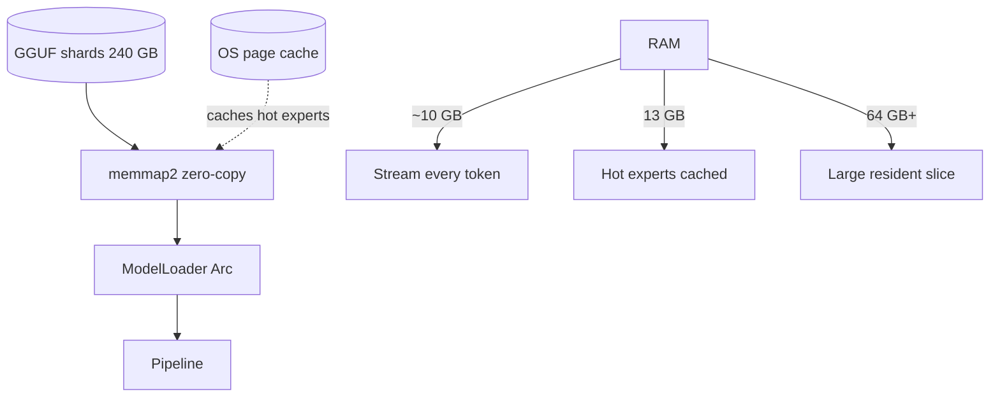

# Memory & Streaming Model

## Problem

Model size: 397B parameters, ~240 GB Q4_K_M GGUF on disk.
RAM floor: ~10 GB.
Active per token: ~9 GB of experts.

The naive requirement is to hold the whole checkpoint in RAM.

## Solution: mmap + OS page cache as expert cache



### Invariants

- Byte-identical output at any RAM budget. RAM changes speed only.
- No explicit expert cache; OS page cache is the cache.
- `memmap2` provides `&[u8]` slices without copying.

### Memory ladder

| free RAM | behavior |
|---|---|
| ~10 GB | every token streams ~9 GB active experts off NVMe |
| 13 GB | hot experts stay cached between tokens |
| 64 GB+ | large slice of routed experts resident |
| 256 GB | dense layers resident, disk wait disappears |

### Streaming MoE

Per layer: Top-10 of 512 experts.
Only touched rows are read from mmap.

```mermaid
flowchart LR
    x[Input] --> Route[route_topk softmax]
    Route --> Slice[Slice expert rows from mmap]
    Slice --> Gemv[gemv_parallel Q4_K]
    Gemv --> Swish[SwiGLU]
    Swish --> Sum[Σ w_e y_e + σ(gate)·shared]
```

## Why it works

- MoE sparsity: 10/512 experts fire per token → 1.95% active.
- Delta-net recurrence keeps sequence memory O(1) for 45 layers.
- Paged KV for 15 full attention layers.
- OS page cache amortizes repeated expert accesses.
