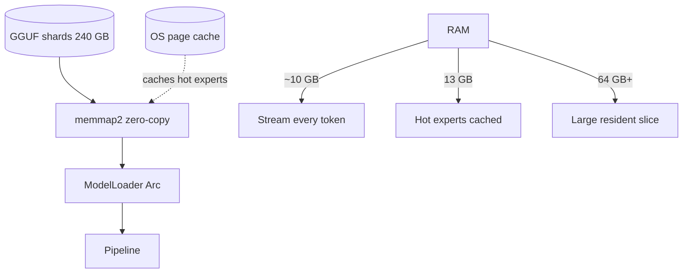
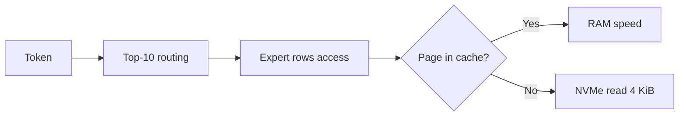

# Memory & Streaming Model

## Problem

Model size: 397B parameters, ~240 GB Q4_K_M GGUF on disk.
RAM floor: ~10 GB.
Active per token: ~9 GB of experts.

The naive requirement is to hold the whole checkpoint in RAM.

$$ \text{RAM}_{\text{naive}} \approx 240\ \text{GB} $$

The engine makes the requirement a dial:

$$ \text{RAM}_{\text{effective}} \approx \text{Active per token} + \text{Page cache hits} $$

## Memory layout

GGUF v3 shards are memory-mapped read-only:

```mermaid
flowchart TB
    File[GGUF shard file on NVMe] --> Mmap[memmap2 MmapMut]
    Mmap --> View[&[u8] slice view, no copy]
    View --> Parser[GGUF parser → tensor metadata]
    Parser --> Weights[ModelWeights Arc<Mmap>]
```

Key properties:
- Zero-copy access: `&[u8]` slices point directly into file pages.
- Lazy faulting: pages are loaded on first access, evicted by kernel LRU.
- No user-space cache: the OS page cache *is* the expert cache.
- Alignment: reads are 4 KiB page aligned by the kernel.

### mmap semantics

Access pattern:
1. CPU touches a byte range → page fault → kernel reads 4 KiB from NVMe into page cache.
2. Subsequent touches to same page are RAM speed.
3. Kernel evicts LRU pages under memory pressure.

This gives us an automatic LRU expert cache without explicit code.

## Solution: mmap + OS page cache as expert cache



### Invariants

- Byte-identical output at any RAM budget. RAM changes speed only.
- No explicit expert cache; OS page cache is the cache.
- `memmap2` provides `&[u8]` slices without copying.

### Page cache behavior

The kernel maintains a bounded page cache:

$$ \text{Hit rate} \approx \frac{\text{Resident experts}}{\text{Total expert accesses}} $$

Hot experts are those frequently routed. With Zipf-like routing, a small fraction accounts for most accesses.



First token warms the cache; steady state is dominated by hits.

### I/O pattern per token

Per token we read:
- 60 layers × 10 experts × 2 weights ≈ 120 expert reads
- ~9 GB active data
- Delta-net state is fixed 128×128 per head → negligible

Total working set per token is bounded, so streaming is feasible.

### Memory ladder details

| free RAM | behavior | typical tokens/s |
|---|---|---|
| ~10 GB | every token streams ~9 GB active experts off NVMe | slow, floor |
| 13 GB | hot experts stay cached between tokens | warm |
| 64 GB+ | large slice of routed experts resident | fast |
| 256 GB | dense layers resident, disk wait disappears | max |

More RAM only buys speed because:
$$ \text{Time per token} = T_{\text{compute}} + T_{\text{miss}} \times (1 - \text{hit rate}) $$

### Memory ladder

| free RAM | behavior |
|---|---|
| ~10 GB | every token streams ~9 GB active experts off NVMe |
| 13 GB | hot experts stay cached between tokens |
| 64 GB+ | large slice of routed experts resident |
| 256 GB | dense layers resident, disk wait disappears |

### Streaming MoE

Per layer: Top-10 of 512 experts.
Only touched rows are read from mmap.

Expert sparsity:
$$
\text{Sparsity} = 1 - \frac{10}{512} \approx 0.9805
$$

Only 1.95% of experts are active per token.

Access cost:
- Each expert weight matrix is Q4_K, ~X MB
- Reading 10 experts per layer → 600 experts per token total
- With mmap, only needed rows are faulted in

```mermaid
flowchart LR
    x[Input x∈R⁴⁰⁹⁶] --> Route[route_topk softmax]
    Route --> Slice[Slice expert rows from mmap]
    Slice --> Dequant[On-the-fly Q4_K dequant]
    Dequant --> Gemv[gemv_parallel AVX2/NEON]
    Gemv --> Swish[SwiGLU]
    Swish --> Sum[Σ w_e y_e + σ(gate)·shared]
```

Shared expert:
- 1 shared expert per MoE layer, always resident
- Added unweighted after gated sum

Memory savings:
$$
\text{Resident MoE} = \text{Shared} + \text{Page cache hits}
$$
With no cache, resident ≈ shared only.

```mermaid
flowchart LR
    x[Input] --> Route[route_topk softmax]
    Route --> Slice[Slice expert rows from mmap]
    Slice --> Gemv[gemv_parallel Q4_K]
    Gemv --> Swish[SwiGLU]
    Swish --> Sum[Σ w_e y_e + σ(gate)·shared]
```

## Why it works

- MoE sparsity: 10/512 experts fire per token → 1.95% active.
$$
\text{Active parameters per token} \approx 0.037 \times 397\text{B}
$$

- Delta-net recurrence keeps sequence memory O(1) for 45 layers.
  State per head is fixed 128×128, independent of sequence length.

- Paged KV for 15 full attention layers.
  KV grows with context but only for 25% of layers.

- OS page cache amortizes repeated expert accesses.
  Hot experts become resident automatically.

- Zero-copy access eliminates double buffering.
  `memmap2` slices avoid `read()` syscalls and user-space copies.

The combination makes 240 GB model runnable in 10 GB RAM with identical output.
