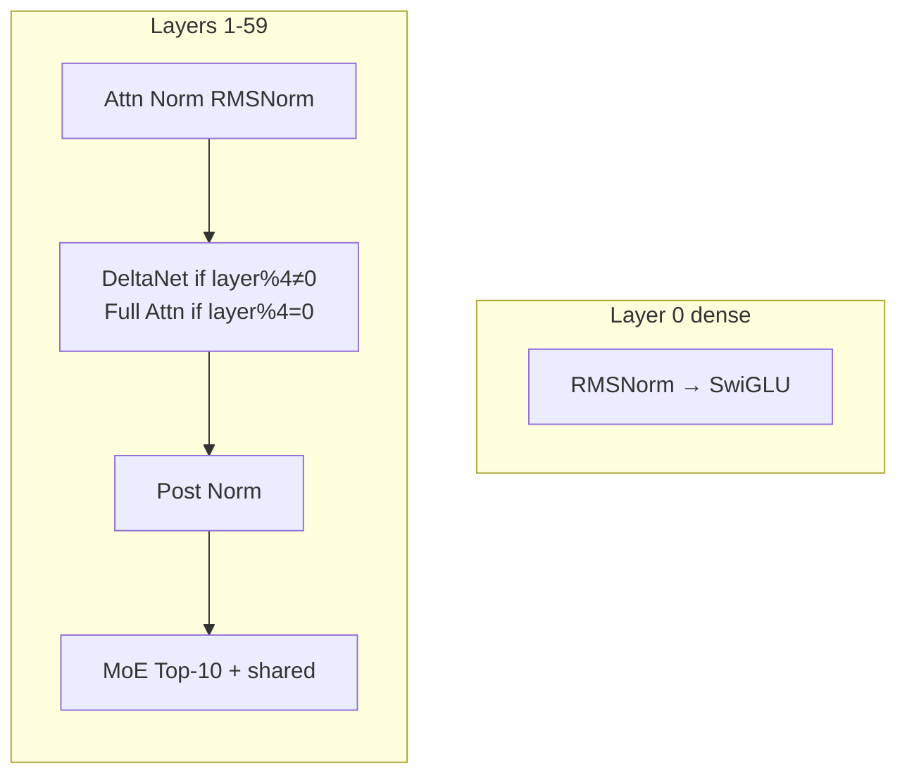
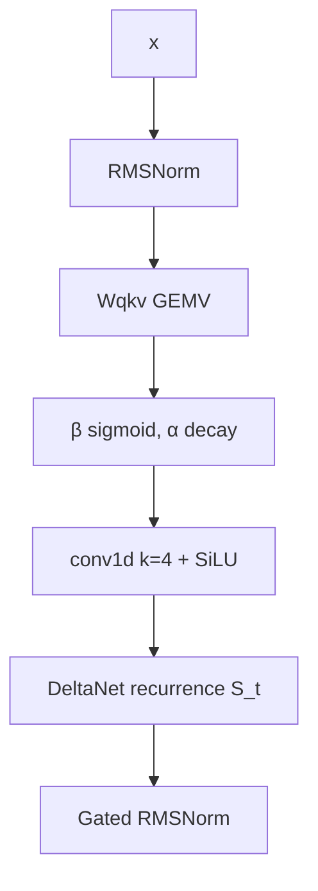
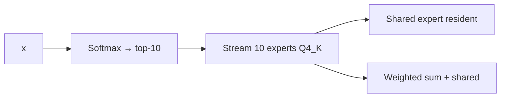

# Model Architecture

Qwen3.5-397B-A17B has 60 layers, 4096 hidden, 512 experts per MoE layer, top-10 routing.

## Layer mix



- **45 delta-net layers**: layer_idx % 4 != 0
- **15 full attention layers**: layer_idx % 4 == 0

## DeltaNet recurrence

Fixed size state per head: 128×128.



State update is O(1) per token.

## Full attention

```mermaid
flowchart TB
    x --> Norm[RMSNorm]
    Norm --> QKV[Wq, Wk, Wv]
    QKV --> RoPE[IMRoPE sections [11,11,10,0]]
    RoPE --> Flash[Flash Attention GQA 16:1]
    Flash --> Gate[sigmoid × Wo]
```

Paged KV cache with optional Q8 quantization.

## MoE



Routing:
- Gate logits → top-k
- Combine weights = softmax over top-k
- Shared expert added unweighted

## Invariants

- `full_attention_interval = 4`
- `expert_count = 512`, `expert_used_count = 10`
- `rope_sections = [11,11,10,0]`
