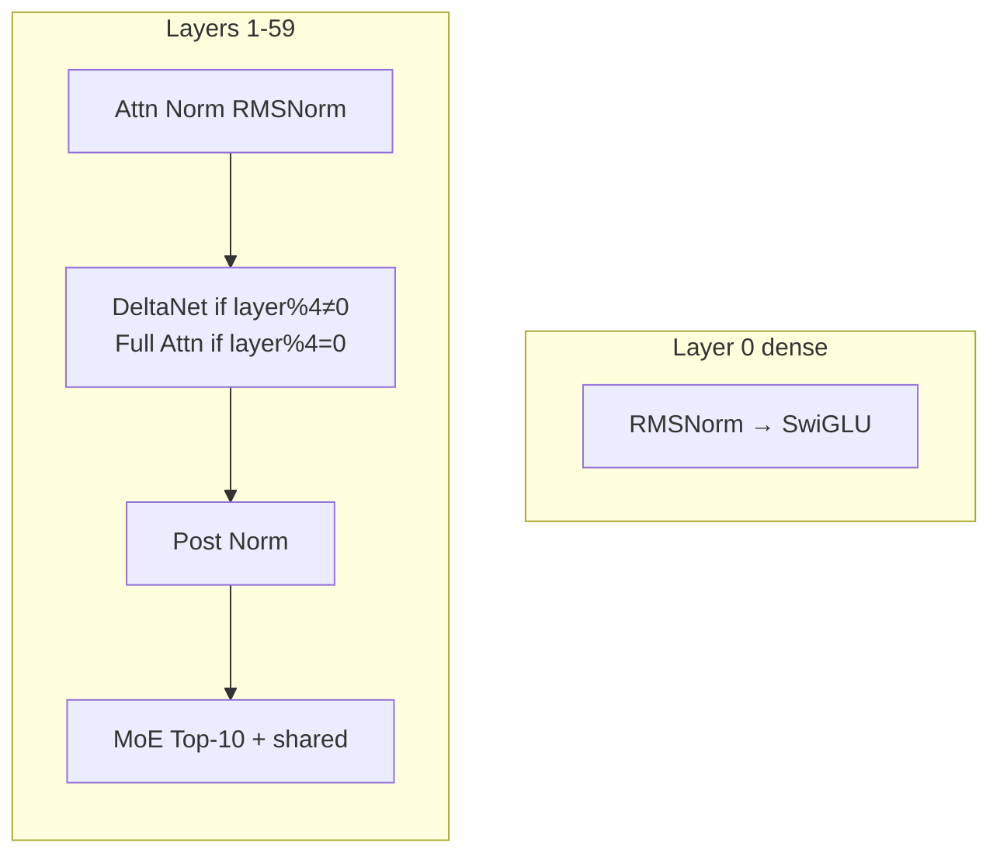
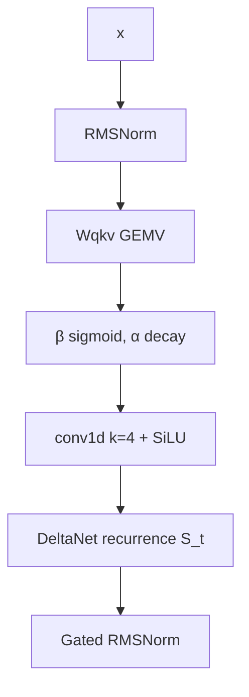
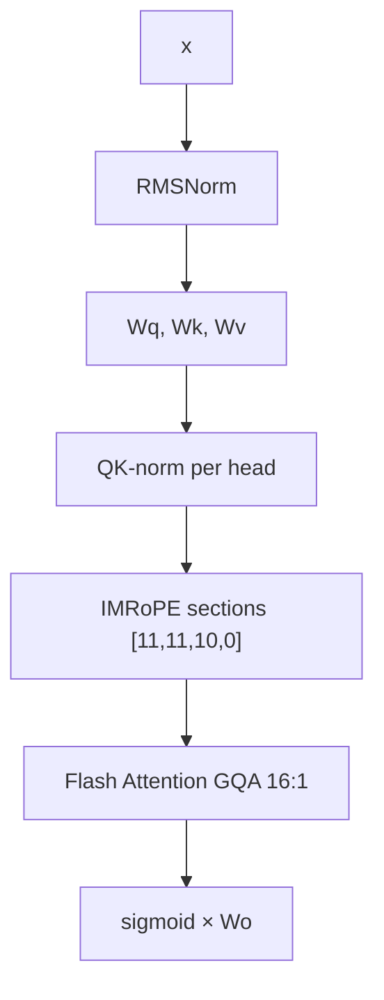
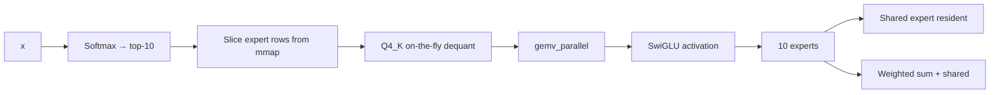

# Model Architecture

Qwen3.5-397B-A17B has 60 layers, 4096 hidden, 512 experts per MoE layer, top-10 routing.

Model dimensions:
- hidden_size = 4096
- intermediate_size = 11008
- num_attention_heads = 32
- num_key_value_heads = 8 for full attention
- num_experts = 512
- num_experts_per_tok = 10
- full_attention_interval = 4

Total parameters ≈ 397B, mixture of dense and MoE layers.

## Layer mix



- **45 delta-net layers**: layer_idx % 4 != 0
- **15 full attention layers**: layer_idx % 4 == 0

## DeltaNet recurrence

Fixed size state per head: 128×128.

Dimension derivation:
$$
\text{conv_dim} = 2 \times \text{key_dim} + \text{value_dim}
$$
$$
\text{ba_dim} = 2 \times \text{ssm_time_step_rank}
$$

Operations:


State update:
$$
\alpha_t = \log(A) \cdot \text{softplus}(W_\alpha h_t + b)
$$
$$
S_t = e^{\alpha_t} S_{t-1} + k_t h_t^\top
$$
$$
o_t = S_t q_t
$$

- $S_t \in \mathbb{R}^{128 \times 128}$ per head
- Per-head `ssm_a` is stored as $\log(A)$ with $A \in (0,1]$, and the state
  is scaled by $\exp(\alpha_t)$ each step (exact formula from
  `qwen3-5.cpp` `build_layer_attn_linear`)
- Memory independent of sequence length → O(1)

State update is O(1) per token, constant memory.

## Full attention

Layers where `layer_idx % 4 == 0` use full attention.



Details:
- Grouped Query Attention: 32 query heads, 8 KV heads → 4:1
- IMRoPE: interleaved RoPE with sections [11,11,10,0]
- Online softmax in Flash Attention
- Paged KV cache with geometric growth
- Optional Q8 quantization halves KV memory

KV memory per token:
$$
\text{KV per token} \approx 2 \times \text{layers}_{\text{full}} \times \text{heads} \times \text{head\_dim} \times 2\ \text{bytes}
$$

Paged KV avoids reallocation during generation.

## MoE

Every layer except layer 0 has a Mixture-of-Experts FFN: **512 experts, 10
active per token** (`expert_count = 512`, `expert_used_count = 10`). This is
what makes 397B parameters run in ~10 GB RSS — only the 10 selected experts'
rows are ever read from disk.



### Weights (per MoE layer)

| GGUF tensor               | Shape                             | Role           |
|---------------------------|-----------------------------------|----------------|
| `ffn_gate_inp.weight`     | `[n_expert, n_embd]`              | router         |
| `ffn_gate_exps.weight`    | `[n_expert, n_ff, n_embd]`        | per-expert gate|
| `ffn_up_exps.weight`      | `[n_expert, n_ff, n_embd]`        | per-expert up  |
| `ffn_down_exps.weight`    | `[n_expert, n_embd, n_ff]`        | per-expert down|
| `ffn_gate_inp_shexp.weight` | `[n_embd]`                      | shared gate    |
| `ffn_gate_shexp.weight`   | `[n_ff_shexp, n_embd]`            | shared gate    |
| `ffn_up_shexp.weight`     | `[n_ff_shexp, n_embd]`            | shared up      |
| `ffn_down_shexp.weight`   | `[n_embd, n_ff_shexp]`            | shared down    |

A row is one `n_embd`-vector in ggml row-major layout (`ne[0]` fastest), so an
expert's weight slice is `expert_id * stride` bytes into the tensor. All expert
tensors are **Q4_K**; the shared expert is small and kept resident.

### Routing (`route_topk`)

For each token's hidden vector `x ∈ ℝ⁴⁰⁹⁶`:

1. Router logits: `logits[e] = ffn_gate_inp[e] · x` for `e ∈ [0, 512)`.
2. Softmax over all 512 experts (f64 accumulation for stability):
   `p[e] = exp(logits[e]) / Σ_j exp(logits[j])`.
3. Keep the top-10 experts: `T = argsort(p, descending)[:10]`.
4. Renormalize the selected weights to sum to 1
   (`w_e = p[e] / Σ_{j∈T} p[j]`, matching `norm_w = true` in llama.cpp's
   `build_moe_ffn`).

### Expert FFN (SwiGLU)

For each selected expert `e`:

```
gate_e = ffn_gate_exps[e] @ x     # [n_ff]
up_e   = ffn_up_exps[e]  @ x      # [n_ff]
act_e  = silu(gate_e) * up_e      # SwiGLU
y_e    = ffn_down_exps[e] @ act_e # [n_embd]
```

Then combine: `out = Σ_{e∈T} w_e · y_e`.

### Shared expert

Added to the MoE output unconditionally (always-resident, stabilizes training):

```
ffn_shexp  = silu(ffn_gate_shexp @ x) * (ffn_up_shexp @ x)      # [n_embd]
gate_shared = sigmoid(ffn_gate_inp_shexp @ x)                    # scalar
out += gate_shared * (ffn_down_shexp @ ffn_shexp)
```

### Streaming execution model

- Router and shared-expert weights are small and resident.
- The 512-expert blocks stay **mmapped on disk**; per token, `moe_ffn_stream`
  only slices the 10 selected experts' byte ranges and runs quantized GEMVs
  (`gemv_parallel`) against them, one expert at a time.
- OS page cache keeps hot expert rows cached between tokens; a cold page
  faults in a 4 KiB block. Memory use is O(active experts), independent of the
  layer's total size.

### Sizes

- 512 experts/layer × 59 MoE layers = **30,208 experts** total.
- 10 active per layer → **590 expert-activations per token**
  (~1.95% of experts touched).
- Per layer the resident MoE data is the shared expert + router, and transient
  per-token work is the 10 selected expert slices.

## Invariants

- `full_attention_interval = 4`
- `expert_count = 512`, `expert_used_count = 10`
- `rope_sections = [11,11,10,0]`
