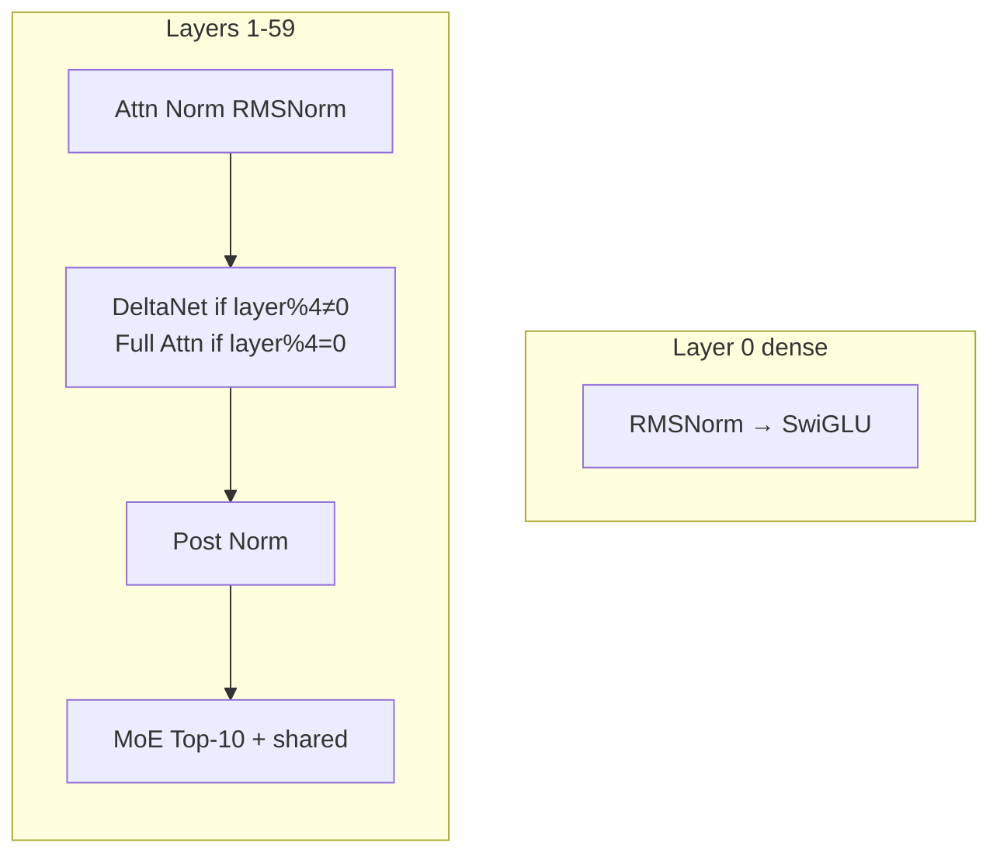
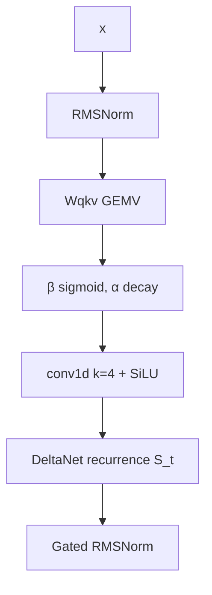
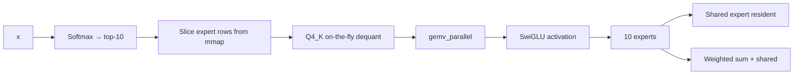

# Model Architecture

Qwen3.5-397B-A17B has 60 layers, 4096 hidden, 512 experts per MoE layer, top-10 routing.

Model dimensions:
- hidden_size = 4096
- intermediate_size = 11008
- num_attention_heads = 32
- num_key_value_heads = 8 for full attention
- num_experts = 512
- num_experts_per_tok = 10
- full_attention_interval = 4

Total parameters ≈ 397B, mixture of dense and MoE layers.

## Layer mix



- **45 delta-net layers**: layer_idx % 4 != 0
- **15 full attention layers**: layer_idx % 4 == 0

## DeltaNet recurrence

Fixed size state per head: 128×128.

Dimension derivation:
$$
\text{conv_dim} = 2 \times \text{key_dim} + \text{value_dim}
$$
$$
\text{ba_dim} = 2 \times \text{ssm_time_step_rank}
$$

Operations:


State update:
$$
S_t = \alpha_t \odot S_{t-1} + k_t h_t^\top
$$
$$
o_t = S_t q_t
$$

- $S_t \in \mathbb{R}^{128 \times 128}$ per head
- $\alpha_t$ is a decay gate, $0 < \alpha_t < 1$
- Memory independent of sequence length → O(1)

State update is O(1) per token, constant memory.

## Full attention

Layers where `layer_idx % 4 == 0` use full attention.

```mermaid
flowchart TB
    x --> Norm[RMSNorm]
    Norm --> QKV[Wq, Wk, Wv]
    QKV --> QKNorm[QK-norm per head]
    QKNorm --> RoPE[IMRoPE sections [11,11,10,0]]
    RoPE --> Flash[Flash Attention GQA 16:1]
    Flash --> Gate[sigmoid × Wo]
```

Details:
- Grouped Query Attention: 32 query heads, 8 KV heads → 4:1
- IMRoPE: interleaved RoPE with sections [11,11,10,0]
- Online softmax in Flash Attention
- Paged KV cache with geometric growth
- Optional Q8 quantization halves KV memory

KV memory per token:
$$
\text{KV per token} \approx 2 \times \text{layers}_{\text{full}} \times \text{heads} \times \text{head\_dim} \times 2\ \text{bytes}
$$

Paged KV avoids reallocation during generation.

## MoE

Every layer except layer 0 has MoE FFN.



Routing:
- Gate logits $g = W_g x$
- Top-k selection: $\mathcal{T} = \text{topk}(g, k=10)$
- Combine weights: $w_i = \frac{\exp(g_i)}{\sum_{j\in\mathcal{T}} \exp(g_j)}$
- Output: $y = \sum_{i\in\mathcal{T}} w_i \text{Expert}_i(x) + \sigma(\text{gate}) \cdot \text{Shared}(x)$

Expert size:
- Each expert: gate_up + down, Q4_K
- 512 experts per layer, 59 MoE layers → 30,208 experts total
- Only 10 per layer active → 590 experts active per token

Shared expert is always resident to stabilize training.

## Invariants

- `full_attention_interval = 4`
- `expert_count = 512`, `expert_used_count = 10`
- `rope_sections = [11,11,10,0]`
