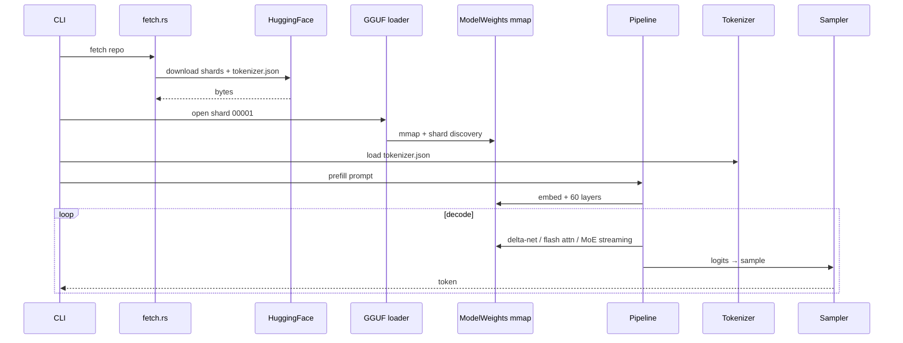
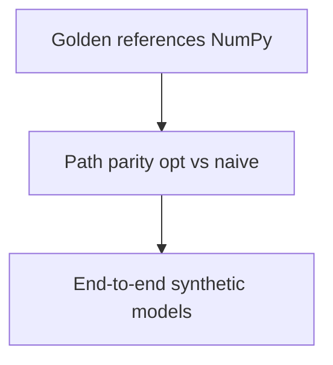

# System Overview

## End-to-end flow

## Core components

- **gguf/**: v3 parser, metadata, multi-shard, memmap2
- **model/config.rs**: typed config + validation
- **model/quant.rs**: Q8/Q4K/Q5K/Q6K codecs
- **model/kernels.rs**: norms, GEMV/GEMM, IMRoPE, flash attn, delta-net, MoE
- **model/loader.rs**: shard assembly → ModelWeights
- **model/pipeline.rs**: prefill/decode, paged KV, scheduler, verify_draft
- **tokenizer/**: tokenizer.json loader

## Invariants

1. Byte-identical output regardless of RAM.
2. Config reader refuses to guess missing fields.
3. Tokenizer is byte-level BPE, deterministic across platforms.
4. All kernels have scalar reference + SIMD parity.

## Validation pyramid

106 tests, no checkpoint required.
