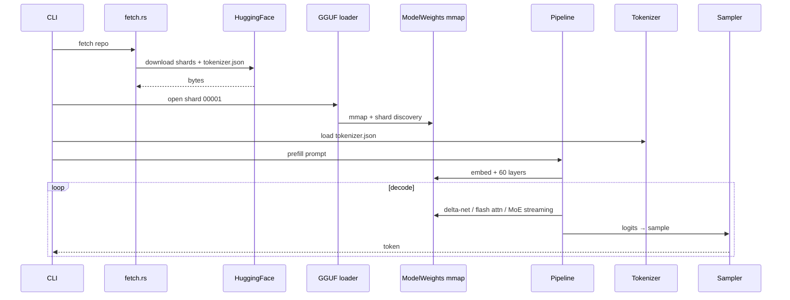
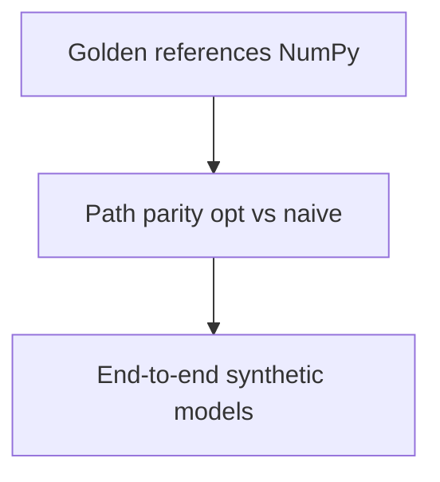

# System Overview

## End-to-end flow

## Core components

- **gguf/**: v3 parser, metadata, multi-shard, memmap2
  - Parses header, tensor metadata, discovers shards
  - Provides zero-copy `&[u8]` slices

- **model/config.rs**: typed config + validation
  - Validates `full_attention_interval = 4`, `expert_count = 512`, `rope_sections`
  - Refuses to guess missing fields

- **model/quant.rs**: Q8/Q4K/Q5K/Q6K codecs
  - Block-wise dequantization with per-block scale
  - SIMD dispatch for AVX2/NEON

- **model/kernels.rs**: norms, GEMV/GEMM, IMRoPE, flash attn, delta-net, MoE
  - Scalar reference paths for testing
  - SIMD optimized paths for speed

- **model/loader.rs**: shard assembly → ModelWeights
  - `Arc<Mmap>` backed raw tensors
  - Shard discovery and tensor binding

- **model/pipeline.rs**: prefill/decode, paged KV, scheduler, verify_draft
  - Prefill: full forward over prompt
  - Decode: incremental with KV carry
  - Speculative verification with state snapshots

- **tokenizer/**: tokenizer.json loader
  - Byte-level BPE, deterministic
  - ChatML template for Qwen3.5

## Invariants

1. Byte-identical output regardless of RAM.
   - Greedy decoding produces same token ids at 10 GB and 256 GB.
   - RAM only affects speed, not correctness.

2. Config reader refuses to guess missing fields.
   - Missing fields → error, not default.
   - Prevents silent model changes.

3. Tokenizer is byte-level BPE, deterministic across platforms.
   - Same input bytes → same token ids on Linux/macOS/Windows.
   - No shell re-encoding: use `--prompt-file`.

4. All kernels have scalar reference + SIMD parity.
   - `kern_check` verifies bit-identical results.
   - No FMA contraction to preserve rounding.

5. Memory streaming is transparent.
   - User sees same API regardless of RAM.
   - OS page cache handles caching automatically.

## Validation pyramid

106 tests, no checkpoint required.
